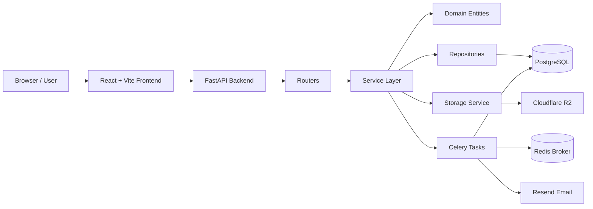

# Food & UMKM Hub

Food & UMKM Hub is a campus food ordering platform for students, UMKM sellers, and administrators. Students can browse food products and stores, place pickup orders, upload payment proof for QRIS payments, and review completed orders. Sellers manage their store, menu, promos, and order workflow. Admins review UMKM store applications.

The project is organized as a full-stack web application with a React frontend and a FastAPI backend. The backend uses domain-based modules with repository and service layers, while the frontend uses role-based routes and generated API clients from the backend OpenAPI schema.

## Features

### Student

- Student registration with academic profile data, email verification, login, and protected routes.
- Product catalog with search, category filters, product detail pages, and open-store filtering.
- UMKM store browsing with search, store detail pages, menu lists, promo display, and store status.
- Store and product favorites.
- Single-store cart with item notes, quantity updates, removal, and replacement confirmation when switching stores.
- Checkout with cash or QRIS payment methods.
- Promo code validation during checkout.
- QRIS payment page with payment proof upload.
- Order activity list with status filters, order detail pages, and pending order cancellation.
- Reviews for completed orders.
- Profile editing, avatar upload, password change, and email change request flow.

### Seller

- Seller registration with store application data.
- Seller dashboard with today's revenue, total orders, sold product count, store rating, review count, and top-selling products.
- Store operational status toggle for approved stores.
- Store application resubmission after rejection.
- Product management: list, search, category filter, create, edit, delete, and availability toggle.
- Product photo upload through the storage signing flow.
- Promo management: create, edit, delete, list, and validation-compatible fixed or percentage discounts.
- Active order workflow: accept, reject with reason, mark ready for pickup, complete, and reconsider rejected orders.
- Order history with status filtering.
- Seller account profile, store profile, store image, QRIS image, and password update flows.

### Admin

- Admin login with role-based routing.
- Store application curation page.
- Store application list with search, status filtering, pagination, and detail view.
- Approve or reject pending UMKM store applications with rejection notes.

## Tech Stack

### Frontend

- React 19
- Vite 7
- TypeScript 5
- Tailwind CSS 4
- TanStack Router v1
- TanStack Query v5
- Zustand v5
- React Hook Form
- Zod
- Hey API OpenAPI TypeScript client generator
- Lucide React
- ESLint
- Prettier

### Backend

- Python 3.14
- FastAPI
- Pydantic v2
- SQLAlchemy 2.0 async
- PostgreSQL with `asyncpg` and `psycopg`
- Alembic
- Redis
- Celery
- PyJWT
- bcrypt
- Ruff
- Pytest
- uv

### Infrastructure and Integrations

- Docker
- Docker Compose
- Nginx frontend container
- Cloudflare R2-compatible object storage for uploads
- Resend for email delivery

## System Architecture

The backend follows a domain-oriented layered architecture. Each major domain, such as orders, products, stores, promos, reviews, favorites, users, and auth, owns its own router, schema, service, repository, model, and domain entity files.

- Layered Architecture: HTTP routes call services, services coordinate business use cases, repositories handle persistence, and domain entities enforce business behavior.
- Repository Pattern: database access is isolated in repository classes instead of being spread across route handlers.
- Service Layer Pattern: authorization, orchestration, and workflow decisions live in services.



## Project Structure

```txt
.
├── backend/
│   ├── app/                  # FastAPI application and domain modules
│   ├── alembic/              # Database migrations
│   ├── scripts/              # Manual utility scripts, including demo seed
│   ├── tests/unit/           # Backend unit tests
│   └── tests/integration/    # Backend integration tests
├── frontend/
│   ├── src/client/           # Generated OpenAPI client
│   ├── src/components/       # Shared frontend components
│   ├── src/features/         # Role and domain-based frontend features
│   ├── src/routes/           # TanStack Router file routes
│   └── src/stores/           # Zustand stores
├── docker-compose.yml        # Local PostgreSQL, Redis, and test database services
├── docker-compose.prod.yaml  # Production Compose stack
├── Makefile                  # Root convenience commands
└── LICENSE
```

## Getting Started

### Prerequisites

- Python 3.14
- uv
- Node.js 24 or newer
- npm
- Docker and Docker Compose

### Backend Setup

```bash
cd backend
cp .env.example .env
uv sync
```

Start the local database and Redis from the repository root:

```bash
cd ..
docker compose up -d postgres redis
```

Apply database migrations:

```bash
cd backend
make migrate/up
```

Run the API:

```bash
cd backend
make run
```

The API runs at `http://127.0.0.1:8000`, with OpenAPI docs at `http://127.0.0.1:8000/docs`.

### Frontend Setup

```bash
cd frontend
npm install
```

Create `frontend/.env`:

```env
VITE_API_BASE_URL=http://localhost:8000
```

Run the frontend:

```bash
cd frontend
npm run dev
```

The Vite dev server runs at `http://localhost:5173` by default.

### Environment Variables

Backend environment variables are documented in `backend/.env.example`. Copy that file to `backend/.env` for local development and fill in values for PostgreSQL, JWT, Redis, Cloudflare R2, and Resend as needed.

The frontend requires `VITE_API_BASE_URL`, which points to the FastAPI backend URL.

Do not commit real secrets.

## Running the Application

Development services:

```bash
docker compose up -d postgres redis
```

Backend:

```bash
cd backend
make run
```

Frontend:

```bash
cd frontend
npm run dev
```

Optional Celery worker and beat for email jobs and unpaid order expiration. Run these in separate terminals:

```bash
cd backend
uv run celery -A app.celery_app:celery_app worker --loglevel=INFO -Q email,orders
```

```bash
cd backend
uv run celery -A app.celery_app:celery_app beat --loglevel=INFO
```

## Database Migration

Create a new Alembic migration:

```bash
cd backend
make migrate/create MSG="describe_change"
```

Apply migrations:

```bash
cd backend
make migrate/up
```

## Demo Accounts

The repository includes an idempotent demo seed script at `backend/scripts/seed_demo.py`. Run it after migrations:

```bash
cd backend
uv run python -m scripts.seed_demo
```

All demo accounts use this password:

```txt
DemoPass123!
```

| Role    | Email                              |
| ------- | ---------------------------------- |
| Admin   | `demo.admin@mixinitlab.tech`       |
| Student | `demo.student@mixinitlab.tech`     |
| Seller  | `demo.seller.rasa@mixinitlab.tech` |
| Seller  | `demo.seller.kopi@mixinitlab.tech` |

The seed creates approved demo stores, products, promos, orders in several statuses, reviews, and favorites.

## License

This project is licensed under the MIT License. See `LICENSE` for the full text.
